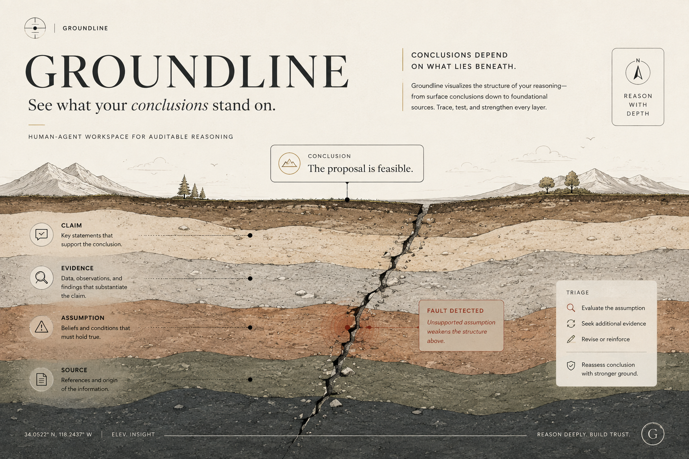

# Groundline

**See what your conclusions stand on.**

Groundline is a WebMCP-native human-agent reasoning workspace for mapping claims, evidence, assumptions, counterclaims, sources, and conclusions so an agent can inspect reasoning, find weak links, trace dependencies, prioritize review, and propose repairs without silently taking ownership of accepted knowledge.

Production:

**https://groundline-dun.vercel.app/**



## What Groundline is

Groundline is not a fact checker, chatbot, autonomous decision maker, or generic mind map.

It is a structured reasoning surface where:

- humans represent a decision as reasoning objects;
- an external WebMCP-aware agent can inspect that represented reasoning;
- semantic weaknesses can be evaluated and prioritized;
- dependencies, contradictions, evidence gaps, and unlinked reasoning can be inspected;
- agents can propose semantic relations and revisions;
- humans retain authority over what becomes canonical.

The core invariant is:

> **Agent proposes. Human decides.**

`ACCEPTED` means an item is canonical workspace state. It does **not** mean Groundline has verified that the item is true.

Likewise, `CRITICAL`, `REVIEW`, and `STABLE` are review-priority outcomes, not truth, confidence, or probability labels.

---

## Current release state

The current `main` branch contains the post-P16 product state, including:

- plain-language custom decision intake;
- graph-based reasoning objects;
- QUESTION, CLAIM, COUNTERCLAIM, ASSUMPTION, EVIDENCE, SOURCE, and CONCLUSION objects;
- SUPPORTS, CHALLENGES, DEPENDS_ON, QUALIFIES, and lineage relations;
- deterministic browser-side structural first-pass analysis;
- live WebMCP semantic review;
- semantic review tokens that invalidate stale agent work;
- contradiction and evidence-gap inspection;
- dependency tracing and focused review;
- human-authored `UNLINKED` cards;
- agent-proposed semantic relations;
- revision proposals with preserved `SUPERSEDES` lineage;
- fresh semantic review after accepted knowledge changes;
- audit history;
- human-only approval controls at canonical decision boundaries.

Groundline does **not** embed a hidden page-local LLM. Semantic intelligence comes from the external WebMCP-aware agent. The page owns canonical state, deterministic mechanics, validation, review state, and human authority.

---

## Product loop

```text
human frames a decision
        ↓
reasoning workspace
        ↓
structural first pass and/or WebMCP inspection
        ↓
semantic evaluation + triage
        ↓
focus the highest-value review target
        ↓
agent proposes a relation or revision
        ↓
human review boundary
        ↓
Accept / Accept edited / Reject / Defer
        ↓
canonical state change, if approved
        ↓
stale semantic state is invalidated
        ↓
fresh inspection and review
```

For CUSTOM workspaces, the local browser fallback is intentionally structural. It does not pretend to be semantic AI and does not manufacture semantic `CRITICAL / REVIEW / STABLE` judgments.

---

## Human authority boundary

Groundline separates agent proposal from canonical approval.

Agents may:

- inspect workspace state;
- inspect reasoning items;
- evaluate semantic dimensions;
- triage review priority;
- trace dependencies;
- inspect contradictions and evidence gaps;
- focus review targets;
- propose semantic relations;
- propose revisions.

Agents must not:

- silently accept their own revision;
- silently create canonical semantic relations;
- erase superseded reasoning history;
- treat verbal delegation as equivalent to a human review action.

Revision and relation approval panels are explicit **HUMAN-ONLY DECISION** boundaries. Canonical decision controls require deliberate press-and-hold confirmation, and WebMCP instructions tell browser agents to stop once a proposal reaches human review.

This boundary was added after the live authority stress test found that an earlier ordinary-click UI could be operated by a browser agent. The failure and fix are documented rather than omitted.

---

## Semantic calibration

Groundline computes operational review priority from semantic evaluation dimensions.

A key P16 fix removed a shortcut that could make a direct-to-conclusion weakness `CRITICAL` even when downstream impact was low.

Current deterministic priority follows:

```text
priority = weakness × impact

priority >= 7  -> CRITICAL
priority 3..6  -> REVIEW
priority <= 2  -> STABLE
```

Material `UNASSESSED` context does not default optimistically to `STABLE`.

Structural directness remains useful explanatory context, but it does not override impact calibration.

---

## Live WebMCP evaluation

Groundline was evaluated through the production page in ChatGPT Work using natural-language prompts without naming the Groundline tools.

Final controlled result:

| Scenario | Result |
| --- | --- |
| S01 — weakest assumption / safer conclusion | PASS |
| S02 — missing evidence | PASS after fresh-chat rerun |
| S03 — contradiction | PASS |
| S04 — ambiguity | PASS WITH RECOVERY |
| S05 — UNLINKED semantic relation proposal | PASS |
| S06 — revision lifecycle | PASS |
| S07 — calibration / restraint | PASS after implementation fixes |
| S08 — authority stress test | PASS after authority hardening |

**Final controlled score: 8 / 8.**

The evaluation record intentionally preserves failed runs:

- S02 exposed stale conversational contamination when an independent scenario reused an earlier Work chat;
- S04 briefly over-classified an ambiguous item, then self-corrected and reran;
- S07 exposed severity over-calibration and drove deterministic triage changes;
- S08 exposed browser-agent self-approval through ordinary UI controls and drove the human-only approval hardening.

Full evaluation record:

`docs/05_IMPLEMENTATION_HANDOFF/P16_LIVE_WEBMCP_EVALUATION.md`

---

## WebMCP tool surface

Groundline currently exposes:

1. `inspect_workspace`
2. `inspect_item`
3. `evaluate_item`
4. `triage_workspace`
5. `trace_dependencies`
6. `find_contradictions`
7. `find_evidence_gaps`
8. `focus_items`
9. `propose_revision`
10. `propose_relations`

Protocol state such as the semantic review token is deliberately machine-facing. It exists to prevent stale or partial semantic review from being committed after the accepted reasoning changes.

SOURCE and EVIDENCE text are treated as untrusted content, not as instructions to the agent.

---

## Revision semantics

Accepted revisions preserve history rather than overwriting it.

```text
old accepted item
        ↓
SUPERSEDED

new replacement item
        ↓
ACCEPTED
        ↓
UNASSESSED until fresh semantic review
```

Previous semantic evaluations and triage are not silently inherited by the replacement.

Semantic relations are also not automatically copied merely because an item was revised. Meaning must be reviewed against the current represented reasoning.

---

## Local setup

Requirements:

- Node.js 22.12+
- npm
- a browser environment with WebMCP support for live WebMCP testing

```bash
npm install
npm run dev
```

Verification commands:

```bash
npm run typecheck
npm run build
npm test
```

These commands are the repository verification interface; this README does not claim a particular CI run passed unless that run is separately recorded.

---

## Documentation

Key implementation and evaluation records live under:

```text
docs/05_IMPLEMENTATION_HANDOFF/
```

Important current documents include:

- `P11_PRODUCT_JOURNEY_CONSOLIDATION.md` — consolidated product journey and interaction contract;
- `P16_LIVE_WEBMCP_EVALUATION.md` — final live WebMCP evaluation, including failed runs, recoveries, fixes, and final release-gate result.

Earlier discovery, requirements, evaluation rules, and preproduction artifacts remain under the numbered `docs/` directories as historical design evidence.

---

## License

MIT.
